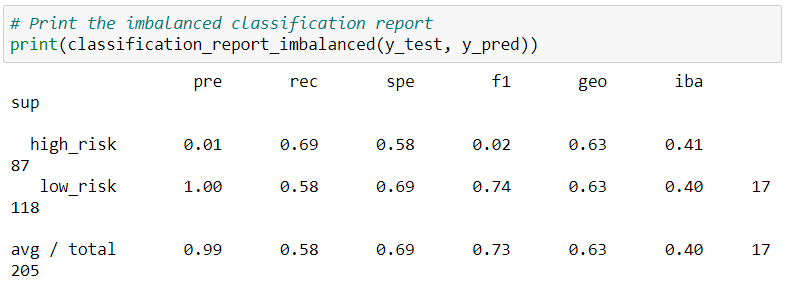

# Credit_Risk_Analysis Overview 
	using our knowledge of the imbalanced-learn and scikit-learn libraries. we use machine learning models by using resampling to determine which is better at predicting credit risk
## Results
  **Naive Random Oversampling** 
		Our balanced accuracy test is 67%, precision for the high risk has a very low positivity at 1% and recall at 62%

   **SMOTE oversampling**
		accuracy score is 66%, precision for the high risk loans has a low positivity at 1% and recall at 64%

   **Undersampling **
   
	balanced accuracy score is 59%, precision at 99% and recall at 44%

	**Combination(over and undersampling)**
		balanced accuracy score is 69%, precision at 99% and recall at 58%

	**Balanced Random Forest Classifier**
		the accuracy score is 88%, precision for high risk loans a low positivity at 3% and recall at 70%

	**Easy Ensemble AdaBoost Classifier**
		balanced accuracy score is 89%, precision is at 99% and recall at 94%

# Summary
	There were 6 supervised machine learning models. In the first four models undersampled, oversampled, and combination of both to try and determine which model is best at prediting which loans are the highest risk. Then we resampled the data using ensemble classifiers to try and predict which loans are high or low risk. The accuracy score is not as high as the ensemble classifiers and the recall in the oversampling, undersampling, and combination. The Easy Ensemble has the best balance of all the models because of its high accuracy score and good balance of precision and recall scores.
